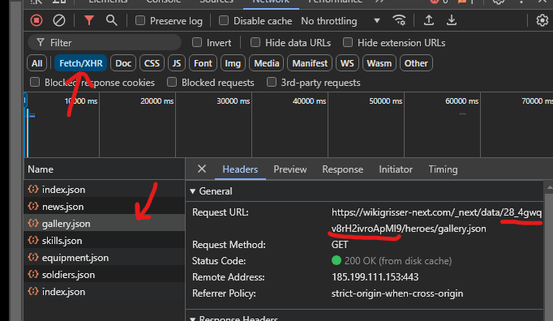

# langrisser-bot

A discord bot for the mobile game Langrisser.

# How to run yourself

- Create a file named `.env` (and `.env.dev` for running in dev mode) and copy the contents of `.env.example` into the file.
- Fill the environment variables in this new file
  - Create a discord application at [dev portal](https://discord.com/developers/applications) and take bot token along with client id from there.
  - `LOGTAIL_TOKEN` is neccessary unless you modify the code. You can create a free account [here](https://betterstack.com/logs)
  - In order to find WIKIGRISSER_URL_HASH, go to [wikigrisser page](https://wikigrisser-next.com/). Open the inspection tool. Refresh the page and click Fetch/XHR below the filter box. Click `gallery.json`. In the headers tab you will see a Request URL. The part between `data/` and `/heroes` is what you need. For example, if request url is `https://wikigrisser-next.com/_next/data/28_4gwqv8rH2ivroApMl9/heroes/gallery.json` then the wikigrisser url hash value is `28_4gwqv8rH2ivroApMl9`. This is only relevant for parsing the data, and this value will change when the website is updated.
  - You can change owner id with your own id.
  - Admin server id is the server that link that appears in `/about` command.
- Install dependencies with `yarn`, refer to [yarn's documentation](https://yarnpkg.com/getting-started/install) if you don't have it.
- Run `yarn build` and once it's done run `yarn start`

> [!NOTE]
> `yarn start` uses `.env` file while `yarn dev` uses `.env.dev` file.

  
*How to find WIKIGRISSER_URL_HASH value*

> [!IMPORTANT]
> Parser will only work if `data/heroes.json` doesn't exist. If you want to force the application to parse data again, simply change the file name to something like `heroes_01_01_24.json` and run the application again. Remember to update WIKIGRISSER_URL_HASH if it changed. I recommend keeping old json files as a backup in case parser is broken —which might happen if the website structure changes.

# Changelog

# 0.3.0
- Improved `/skill` autocomplete suggestions.
- Added support for heroes that are not released in global server yet.
  - Note that their data needs to be manually added.
- Added unreleased hero data "Awakener"

# 0.2.3
- Fixed a bug with `/about` command.
- `/about` command provides doesn't provide unique user count anymore.
- Added ephemeral option back to `/about` command.
# 0.2.2
- Fixed a bug that occured while using `/hero image` command if the hero name was too long.

# 0.2.1
- Bug fixes

## 0.2.0
- Removed `/image` and `/bond` commands and added them as subcommands to `/hero` command.
- Added `/hero skill` command to look up for hero skills.
- `/hero image` command's select menu doesn't disappear anymore after choosing an option.
- All menus are now only interactable by the user who initiated the command.
  - *Only matters if the user has used the command with `ephemeral=false` option.*
- All subcommands of `/hero` command now shows icons of the hero's factions on embed's title.
- Added `/skill` command.

## 0.1.0
- Initial version